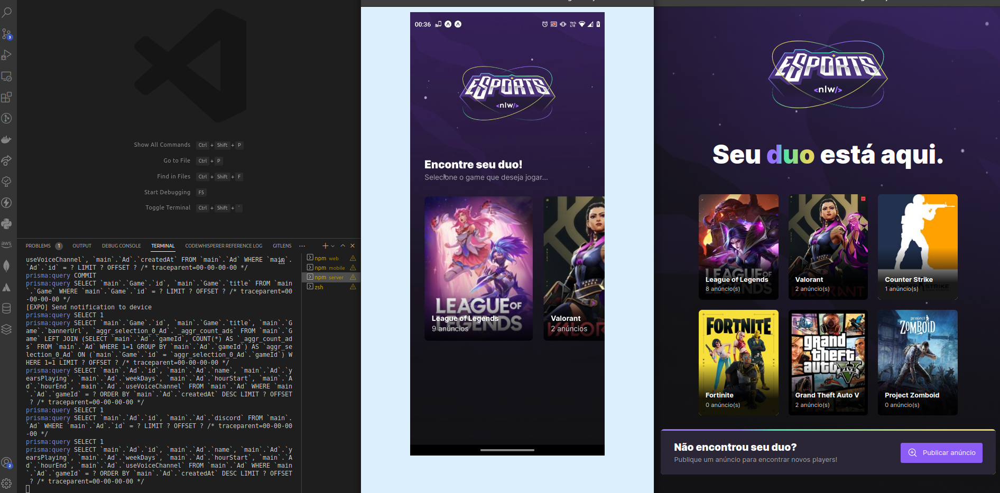

# NLW eSports - Trilha Ignite

## Sobre

Monorepo da trilha Ignite envolvendo as seguintes stacks:

- Backend em Nodejs: [pasta server](./server)
- Frontend WEB em ReactJS: [pasta web](./web)
- Frontend mobile em React Native: [pasta mobile](./mobile)

A trilha Ignite mencionada faz parte da NLW eSports. A NLW é um evento online e gratuito de programação ofertado pela equipe da [Rocketseat](https://www.rocketseat.com.br/) :rocket:

### Showcase

Clique na thumb abaixo para visualizar um pequeno vídeo :)

P.S.: A notificação chega ao dispositivo após o disparo feito a API do Expo pelo server. O Expo Notification Token ainda está setado de forma estática, mas logo isso será mais amigável, assim como as demais funcionalidades de front a back :)

## 🤝 Colaboradores

<table>
  <tr>
    <td align="center">
      <a href="#">
         
        
          <b>Paulo Lima</b>
        
      </a>
    </td>
  </tr>
</table>

#### Obrigado por chegar até aqui! ❤️  